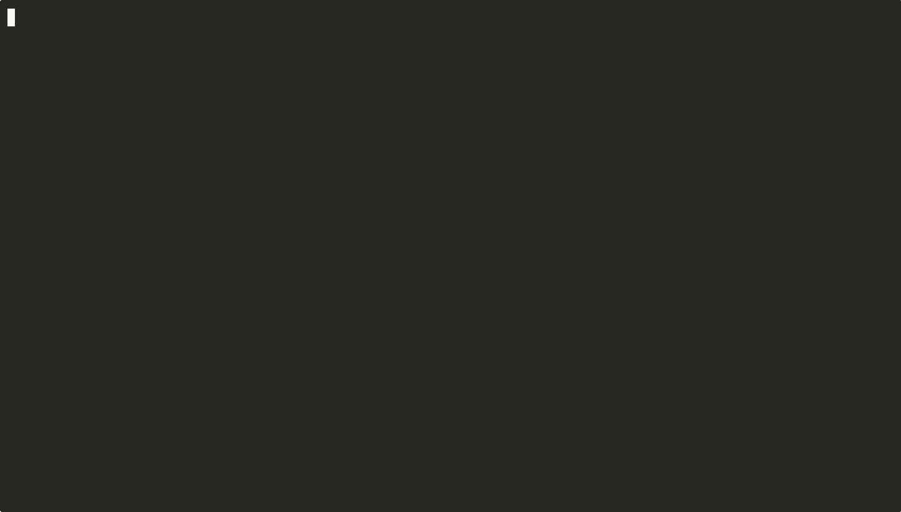

# ownscribe

[](LICENSE)
[](https://www.python.org/downloads/)

Local-first meeting transcription and summarization CLI.
Record, transcribe, and summarize meetings and system audio entirely on your machine – no cloud, no bots, no data leaving your device by default.

> **This is a personal fork** of [paberr/ownscribe](https://github.com/paberr/ownscribe), diverged in two ways from upstream:
> transcription runs on [MLX](https://github.com/ml-explore/mlx) (Apple GPU) instead of WhisperX/CTranslate2 (CPU-only),
> and finished transcripts can be auto-filed into an Obsidian vault as categorized notes. Install instructions below
> reflect this fork, not the PyPI package.

> System audio capture requires **macOS 14.2 or later**. Transcription requires Apple Silicon (MLX is Metal-only).

## Table of Contents

- [Privacy](#privacy)
- [Features](#features)
- [Requirements](#requirements)
- [Installation](#installation)
- [Usage](#usage)
- [Configuration](#configuration)
- [Summarization Templates](#summarization-templates)
- [Speaker Diarization](#speaker-diarization)
- [Obsidian Vault Filing](#obsidian-vault-filing)
- [Acknowledgments](#acknowledgments)
- [Contributing](#contributing)
- [License](#license)

## Privacy

ownscribe **does not**, by default:

- send audio to external servers
- upload transcripts
- require cloud APIs
- store data outside your machine

All audio, transcripts, and summaries remain local. Transcription (MLX Whisper), diarization (pyannote), and local
summarization (Phi-4-mini) all run on-device.

**Two opt-in exceptions:** [Obsidian vault filing](#obsidian-vault-filing) and [speaker naming](#speaker-diarization)
both send transcript *text* (never audio) to Claude via the `claude` CLI — vault filing to categorize/summarize it
into a note, speaker naming to describe each speaker's role so you can identify them. Both are enabled by default in
this fork's config — set `[obsidian] enabled = false` and `[diarization] ask_speaker_names = false` to keep
everything fully local, or use a hosted [summarization backend](#configuration) instead if you want LLM
summarization without either.

<p align="center">
  
</p>

## Features

- **System audio capture** — records all system audio natively via Core Audio Taps (macOS 14.2+), no virtual audio drivers needed
- **Microphone capture** — records system + mic audio simultaneously by default (press `m` to mute/unmute, or use `--no-mic`)
- **MLX Whisper transcription** — GPU-accelerated speech-to-text on Apple Silicon, with word-level timestamps
- **Speaker diarization** — optional speaker identification via pyannote (requires HuggingFace token; runs on MPS), with an interactive prompt to name each speaker afterward
- **Pipeline progress** — live checklist showing transcription, diarization sub-steps, and summarization progress
- **Local LLM summarization** — structured meeting notes with a built-in model (Phi-4-mini); also supports Ollama, LM Studio, or any OpenAI-compatible server
- **Summarization templates** — built-in presets for meetings, lectures, and quick briefs; define your own in config
- **Ask your meetings** — ask natural-language questions across all your meeting notes; uses a two-stage LLM pipeline with keyword fallback
  <br>
- **Obsidian vault filing** — every transcript is categorized, summarized, and filed into an Obsidian vault as a note, with a confirm-before-write preview
- **Silence auto-stop** — automatically stops recording after sustained silence (default: 5 minutes, configurable)
- **One command** — just run `ownscribe`, press Ctrl+C when done, get transcript + vault note

## Requirements

- macOS 14.2+ on Apple Silicon (system audio capture *and* MLX transcription both require it)
- Python 3.12+
- [ffmpeg](https://ffmpeg.org/) — `brew install ffmpeg`
- Xcode Command Line Tools (`xcode-select --install`)
- [Claude Code](https://github.com/anthropics/claude-code) CLI (`claude`), authenticated — needed for
  [Obsidian vault filing](#obsidian-vault-filing) and [speaker naming](#speaker-diarization), both enabled by default

Summarization works out of the box — a local model (Phi-4-mini, ~2.4 GB) downloads automatically on first run. Optionally, you can use [Ollama](https://ollama.ai), [LM Studio](https://lmstudio.ai), or any OpenAI-compatible server instead (see [Configuration](#configuration)).

Works with any app that outputs audio through Core Audio (Zoom, Teams, Meet, etc.).

> **Tip:** Your terminal app (Terminal, iTerm2, VS Code, etc.) needs **Screen Recording** permission to capture system audio.
> Open the settings panel directly with:
> ```bash
> open "x-apple.systempreferences:com.apple.preference.security?Privacy_ScreenCapture"
> ```
> Enable your terminal app, then restart it. Both capture modes need this permission, `picker` and `all` alike.
>
> The microphone is recorded by default, so macOS also asks for **Microphone** permission on the first run.
> If you dismissed that prompt, enable your terminal app here:
> ```bash
> open "x-apple.systempreferences:com.apple.preference.security?Privacy_Microphone"
> ```
> Recording fails to start while the microphone is unavailable — use `--no-mic` to capture system audio only.

## Installation

This fork is installed from source with a plain virtualenv — no `uv` involved.

```bash
# Clone the repo
git clone https://github.com/paberr/ownscribe.git
cd ownscribe

# Build the Swift audio capture helper (optional - auto-downloads if skipped)
bash swift/build.sh

# Create and activate a venv, then install (editable: changes to the checkout
# take effect without reinstalling)
python3.12 -m venv .venv
source .venv/bin/activate
pip install -e '.[all]'
```

`ownscribe` then runs as a normal command as long as the venv is active — reactivate it in new shells with
`source .venv/bin/activate` (or add that line to your shell profile).

If you'd rather use a conda/mamba environment instead of `.venv`, the same `pip install -e '.[all]'` works inside
any activated Python 3.12 environment.

### Alternative summarization backends

The built-in local model works out of the box. If you'd rather call a hosted backend, install the matching extra:

```bash
pip install -e '.[ollama]'   # use Ollama
pip install -e '.[openai]'   # use any OpenAI-compatible server (LM Studio, llama-server, etc.)
pip install -e '.[all]'      # install everything (default above)
```

## Usage

### Record, transcribe, and summarize a meeting

```bash
ownscribe                    # records system audio + mic, Ctrl+C to stop
```

This will:
1. Capture system audio and your microphone until you press Ctrl+C (or auto-stop after 5 minutes of silence); press `m` to mute/unmute the mic while recording
2. Transcribe with MLX Whisper (and diarize, if enabled)
3. Summarize with your local LLM (if `[summarization] enabled = true`)
4. File the transcript into your Obsidian vault as a categorized note, with a preview you confirm before it's written (if `[obsidian] enabled = true`)
5. Save everything to `~/ownscribe/YYYY-MM-DD_HHMM/`, renamed to `~/ownscribe/YYYY-MM-DD_HHMM_meeting-title/` once the local summary produces a title

> **Note:** By default, ownscribe records all system audio directly with no prompt. To show a macOS source picker on each launch instead, set `capture_mode = "picker"` in the `[audio]` config section.

On first run, the Whisper model, pyannote, and the summarization model may download model files. ownscribe shows a `Preparing models` step and best-effort download progress in the TUI while this happens. Use `ownscribe warmup` to pre-download all models.

### Options

```bash
ownscribe --no-mic                            # capture system audio only (the mic is on by default)
ownscribe --mic-device "MacBook Pro Microphone" # capture system audio + a specific mic instead of the default one
ownscribe --device "MacBook Pro Microphone"   # use mic instead of system audio (switches to the sounddevice backend)
ownscribe --no-summarize                      # skip local LLM summarization
ownscribe --diarize                           # enable speaker identification
ownscribe --language en                       # set transcription language (default: auto-detect)
ownscribe --model large-v3                    # use a larger Whisper model
ownscribe --format json                       # output as JSON instead of markdown
ownscribe --no-keep-recording                 # auto-delete WAV files after transcription
ownscribe --template lecture                  # use the lecture summarization template
ownscribe --silence-timeout 600               # auto-stop after 10 minutes of silence
ownscribe --silence-timeout 0                 # disable silence auto-stop
```

### Subcommands

```bash
ownscribe devices                  # list audio devices (uses native CoreAudio when available)
ownscribe apps                     # list running apps with PIDs
ownscribe warmup                   # prefetch MLX Whisper/pyannote models before a meeting
ownscribe transcribe recording.wav # transcribe an audio or video file: wav/mp3/mp4/mov/mkv (saved alongside)
ownscribe summarize transcript.md  # summarize a transcript (saves alongside the input)
ownscribe resume ./2026-02-20_1736 # resume a partial run, or process a folder's audio/video recording
ownscribe ask "question"           # search your meetings with a natural-language question
ownscribe config                   # open config file in $EDITOR
ownscribe cleanup                  # remove ownscribe data from disk
```

> **Video files work too.** Anywhere ownscribe accepts an audio file it also accepts a video container (mp4, mov, mkv, m4v) — it extracts the audio track via ffmpeg. To turn a recording into full notes, drop it in a folder and run `ownscribe resume ./that-folder/` (transcript + summary); use `ownscribe transcribe meeting.mp4` for a transcript only.

`transcribe` and `resume` also run the [Obsidian vault-filing](#obsidian-vault-filing) step, same as a live recording — they share the same underlying pipeline.

Use `warmup` ahead of time to avoid first-run model download delays while recording:

```bash
ownscribe warmup                    # prefetch the Whisper model (+ diarization if enabled in config)
ownscribe warmup --with-diarization # force diarization warmup for this run
```

### Searching Meeting Notes

Use `ask` to search across all your meeting notes with natural-language questions:

```bash
ownscribe ask "What did Anna say about the deadline?"
ownscribe ask "budget decisions" --since 2026-01-01
ownscribe ask "action items from last week" --limit 5
```

This runs a two-stage pipeline:
1. **Find** — sends meeting summaries to the LLM to identify which meetings are relevant
2. **Answer** — sends the full transcripts of relevant meetings to the LLM to produce an answer with quotes

If the LLM finds no relevant meetings, a keyword fallback searches summaries and transcripts directly.

## Configuration

Config is stored at `~/.config/ownscribe/config.toml`. Run `ownscribe config` to create and edit it.

```toml
[audio]
backend = "coreaudio"     # "coreaudio" or "sounddevice"
device = ""               # empty = system audio
mic = true                # also capture microphone input
mic_device = ""           # specific mic device name (empty = default)
capture_mode = "all"      # "all" = capture all system audio directly; "picker" = show source picker
silence_timeout = 300     # seconds of silence before auto-stop; 0 = disabled

[transcription]
model = "base"            # tiny, base, small, medium, large-v3 (mapped to an mlx-community MLX conversion)
language = ""             # empty = auto-detect
threads = 0               # unused by the MLX backend (GPU-only); kept for config compatibility
# initial_prompt = ""     # prime Whisper with context: domain vocab, speaker names, expected phrases
# hotwords = ""           # folded into initial_prompt (MLX has no dedicated hotwords mechanism)

[diarization]
enabled = false
hf_token = ""             # HuggingFace token for pyannote
min_speakers = 0          # 0 = auto-detect
max_speakers = 0
telemetry = false         # allow HuggingFace Hub + pyannote metrics telemetry
device = "auto"           # "auto" (mps if available), "mps", or "cpu"
ask_speaker_names = true  # interactively name SPEAKER_00/01/... after diarization (skipped when not a TTY)

[summarization]
enabled = true
backend = "local"         # "local" (built-in, no server needed), "ollama", or "openai"
model = "phi-4-mini"      # local: "phi-4-mini", path to GGUF, or hf:owner/repo/file.gguf; ollama/openai: model name
# host = "http://localhost:11434"  # only for ollama/openai backends
# api_key = ""            # only for openai backend; required by servers like oMLX (or set OPENAI_API_KEY)
# template = "meeting"    # "meeting", "lecture", "brief", or a custom name
# context_size = 0        # context window in tokens; 0 = auto-detect (8192 for local). Longer
                          # transcripts are summarized in chunks and merged, whatever the size.

# Custom templates (optional):
# [templates.my-standup]
# system_prompt = "You summarize daily standups."
# prompt = "List each person's update:\n{transcript}"

[output]
dir = "~/ownscribe"
audio_dir = ""            # directory for audio recordings; empty = same as dir
format = "markdown"       # "markdown" or "json"
keep_recording = true     # false = auto-delete WAV after transcription

[obsidian]
enabled = true                # file every transcript into the vault as a categorized note
vault_dir = "~/Documents/obsidian/Personal"
claude_bin = ""                # path to the claude CLI; empty = auto-detect via PATH
confirm_before_filing = true  # show the proposed note and ask before writing (skipped when not a TTY)
```

**Precedence:** CLI flags > environment variables (`HF_TOKEN`, `OLLAMA_HOST`, `OPENAI_API_KEY`) > config file > defaults.

## Summarization Templates

Built-in templates control how transcripts are summarized:

| Template | Best for | Output style |
|----------|----------|-------------|
| `meeting` | Meetings, standups, 1:1s | Summary, Key Points, Action Items, Decisions |
| `lecture` | Lectures, seminars, talks | Summary, Key Concepts, Key Takeaways |
| `brief` | Quick overviews | 3-5 bullet points |

Use `--template` on the CLI or set `template` in `[summarization]` config. Default is `meeting`.

Define custom templates in config:

```toml
[templates.my-standup]
system_prompt = "You summarize daily standups."
prompt = "List each person's update:\n{transcript}"
```

Then use with `--template my-standup` or `template = "my-standup"` in config.

### Long meetings

Transcripts that do not fit the model's context window are summarized in overlapping chunks split on
segment boundaries, and the partial notes are then merged into one summary under the same template —
custom templates included. Shorter meetings are summarized in a single pass as before. Set
`context_size` in `[summarization]` if a model's window should not be auto-detected; for the local
backend it also sets the window the model is loaded with.

This is separate from [Obsidian vault filing](#obsidian-vault-filing), which does its own summarization via Claude
and isn't affected by `[summarization]` settings.

## Speaker Diarization

Speaker identification requires a HuggingFace token with access to the pyannote diarization model:

1. Accept the terms for [pyannote/speaker-diarization-community-1](https://huggingface.co/pyannote/speaker-diarization-community-1) on HuggingFace
2. Create a token at https://huggingface.co/settings/tokens
3. Set `HF_TOKEN` env var or add `hf_token` to config
4. Run with `--diarize`

On Apple Silicon Macs, diarization automatically uses the Metal Performance Shaders (MPS) GPU backend for ~10x faster processing. Set `device = "cpu"` in the `[diarization]` config section to disable this.

Diarization runs independently of transcription — it uses pyannote via PyTorch/MPS, unaffected by the MLX Whisper
swap. When diarization ran, speaker turns are labeled `SPEAKER_00`, `SPEAKER_01`, etc. (anonymous IDs, not names)
in `transcript.md`/`.json`, unless you name them interactively (see below).

### Naming speakers

After diarization, if `[diarization] ask_speaker_names = true` (the default) and you're at a TTY, ownscribe asks
Claude for a one-sentence role blurb per speaker label — what they did/said in the meeting — then prompts you for a
real name per speaker:

```
--- Speaker identification ---
SPEAKER_00 — Opened the meeting and walked through the Q3 budget numbers.
  Name (blank to keep label): Alice
SPEAKER_01 — Pushed back on the timeline and volunteered to own the migration.
  Name (blank to keep label): Bob
```

Blank input keeps that speaker's label as-is — you can name some speakers and skip others. Names apply to
`transcript.md`/`.json` on disk *and* the vault note (Claude writes the summary using the real names directly,
rather than a find-and-replace afterward). This is skipped automatically when not diarizing, not at a TTY (e.g. a
scripted `ownscribe resume`), or `ask_speaker_names = false`. It does not affect ownscribe's own local-LLM
`summary.md`, which still uses `SPEAKER_XX` labels if summarization is enabled.

## Obsidian Vault Filing

After each transcript is produced — from a live recording, `ownscribe transcribe`, or `ownscribe resume` — ownscribe
can automatically categorize, summarize, and file it into an Obsidian vault as a note. This runs in-process, right
after `transcript.md`/`.json` is written; there's no separate watcher or background job.

1. The transcript (with speaker labels, if diarization ran) is sent to a prompt template.
2. `claude -p ... --allowedTools ""` runs headlessly (no tool access — it can only return text) to pick a category,
   write a topic-based markdown summary with action items, and suggest a title and tags.
3. If `confirm_before_filing = true` and you're at a TTY, the proposed title/category/tags/body are printed and you
   confirm before anything is written.
4. The note is written to `<vault_dir>/<category folder>/<date> <title>.md`, with frontmatter including
   `source: transcript-pipeline` and `recorder: ownscribe`. Unrecognized categories fall back to `Meetings Inbox/`
   with `status: "needs-review"`.

The category list and folder mapping (`CATEGORY_TO_FOLDER` in `src/ownscribe/vault_filing.py`) are hardcoded to one
person's vault taxonomy — edit that file to repoint the categories at your own vault structure. The prompt itself is
seeded to `~/.config/ownscribe/vault_prompt_template.txt` on first run and can be edited there directly, the same
way `config.toml` is.

Failures here (network, auth, a malformed response) are always non-fatal — the transcript you already have is never
at risk, only the vault-filing step is skipped with a warning.

Set `[obsidian] enabled = false` to turn this off entirely and keep ownscribe fully local.

## Acknowledgments

ownscribe builds on some excellent open-source projects:

- [MLX](https://github.com/ml-explore/mlx) / [mlx-whisper](https://github.com/ml-explore/mlx-examples/tree/main/whisper) — GPU-accelerated Whisper inference on Apple Silicon
- [WhisperX](https://github.com/m-bain/whisperX) — audio loading and diarization glue (`DiarizationPipeline`, `assign_word_speakers`)
- [pyannote.audio](https://github.com/pyannote/pyannote-audio) — speaker diarization
- [llama.cpp](https://github.com/ggerganov/llama.cpp) / [llama-cpp-python](https://github.com/abetlen/llama-cpp-python) — local LLM inference
- [Ollama](https://ollama.ai) — local LLM serving
- [Claude Code](https://github.com/anthropics/claude-code) — headless summarization/categorization for Obsidian vault filing
- [Click](https://click.palletsprojects.com) — CLI framework

## Contributing

See [CONTRIBUTING.md](CONTRIBUTING.md) for development setup, tests, and open contribution areas.

## License

MIT
